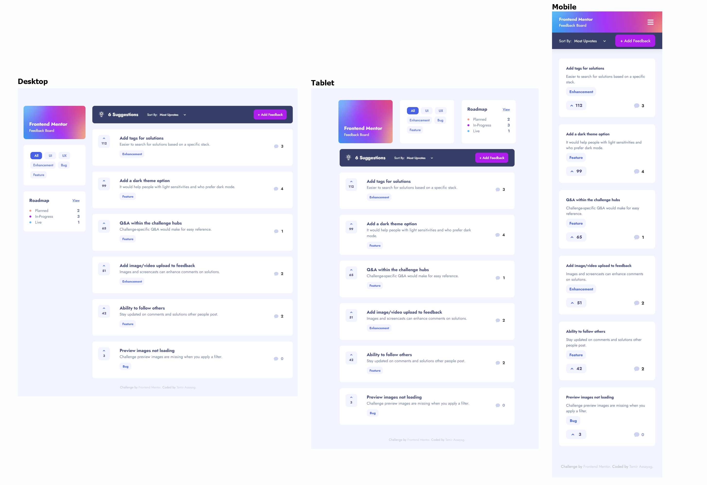

# Frontend Mentor - Product feedback app solution

This is a solution to the [Product feedback app challenge on Frontend Mentor](https://www.frontendmentor.io/challenges/product-feedback-app-wbvUYqjR6). Frontend Mentor challenges help you improve your coding skills by building realistic projects.

## Table of contents

- [The challenge](#the-challenge)
- [Screenshot](#screenshot)
- [Links](#links)
- [My process](#my-process)
- [Built with](#built-with)

### The challenge

Users should be able to:

✔ - View the optimal layout for the app depending on their device's screen size
✔ - See hover states for all interactive elements on the page
✔ - Create, read, update, and delete product feedback requests
✔ - Receive form validations when trying to create/edit feedback requests
✔ - Sort suggestions by most/least upvotes and most/least comments
✔ - Filter suggestions by category
✔ - Add comments and replies to a product feedback request
✔ - Upvote product feedback requests
✔ - **Bonus**: Keep track of any changes, even after refreshing the browser (`localStorage` could be used for this if you're not building out a full-stack app)

### Screenshot

### Links

- Solution URL: [Frontend Mentor] (https://www.frontendmentor.io/solutions/responsive-product-feedback-app-using-vuejs-vuetify-vuex-and-scss-7uOf7-Wrs)
- Live Site URL: [Nelitfy] (https://hopeful-murdock-83580e.netlify.app/)

## My process

### Built with

- Semantic HTML5 markup
- SCSS custom properties
- SCSS mixin
- Flexbox
- CSS Grid
- Mobile-first workflow
- [Vue.js](https://vuejs.org/) - Vue.js Framework
- [Vuex](https://vuex.vuejs.org/) - It serves as a centralized store for all the components in an application.
- [Vuetify](https://vuetifyjs.com/en/) - For style components
- [Inline-Svg](https://github.com/shrpne/vue-inline-svg) - To load efficiently svg files
- [Vue-Screen](https://github.com/reegodev/vue-screen) - Reactive window size and media query states for VueJS.
- [Vuelidate](https://vuelidate.js.org/) - For form validations
- [Include-Media](https://github.com/eduardoboucas/include-media) - Simple and elegant media queries in SCSS
- [PortalVue](https://github.com/LinusBorg/portal-vue) - A Portal Component for Vuejs, to render DOM outside of a component, anywhere in the document.
